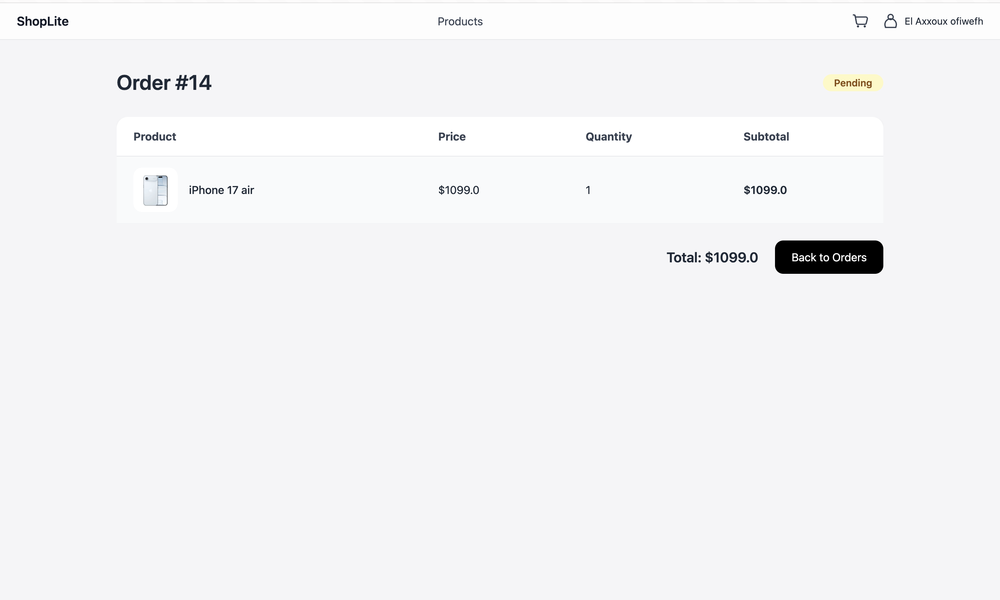

# E-Commerce Web Application


## Description

This is a web application based on **MVC2** and **JPA**. The main goal of this project is to master the **Java Persistence API (JPA)** by developing a dynamic web application simulating an e-commerce website. The controller layer follows the **MVC2 pattern**, where a single servlet handles multiple actions related to specific management tasks.

The application focuses on managing:

* Shopping cart
* Product showcase (vitrine)
* Users (internautes)

---

## Tools & Technologies

* **IDE:** IntelliJ IDEA
* **Build Tool:** Maven
* **Application Server:** WildFly
* **Database:** MySQL
* **Technologies:** JPA, CDI, JSP, JSTL
* **Optional Frontend Enhancements:** JavaScript, jQuery

---

## Features

1. User management (registration, login, profile)
2. Product catalog and showcase
3. Shopping cart management
4. MVC2 architecture implementation
5. Integration with MySQL via JPA

---

## Project Setup

### Step 1: UML Diagram


* Design a **class diagram** representing the e-commerce site.
* Focus on:

    * Cart management
    * Product showcase
    * User management

### Step 2: Project Creation

1. Create a **Dynamic Web Project** (Web module version > 3).
2. Convert it to a **Maven project**.
3. Add dependencies in `pom.xml`:

```xml
<dependency>
    <groupId>com.mysql</groupId>
    <artifactId>mysql-connector-j</artifactId>
    <version>9.4.0</version>
</dependency>

<dependency>
    <groupId>org.projectlombok</groupId>
    <artifactId>lombok</artifactId>
    <version>1.18.42</version>
</dependency>

<dependency>
    <groupId>org.mindrot</groupId>
    <artifactId>jbcrypt</artifactId>
    <version>0.4</version>
</dependency>

<dependency>
    <groupId>jakarta.servlet.jsp.jstl</groupId>
    <artifactId>jakarta.servlet.jsp.jstl-api</artifactId>
    <version>3.0.2</version>
</dependency>

<dependency>
    <groupId>org.glassfish.web</groupId>
    <artifactId>jakarta.servlet.jsp.jstl</artifactId>
    <version>3.0.1</version>
</dependency>
```

4. Project Structure

```plaintext
shoplite/
├── src/main/java/ma/fstt/shoplite/
│   ├── configs/         # EntityManager and JPA configuration
│   ├── controllers/     # Servlets for Cart, User, Product, Order, Category
│   ├── dtos/            # Data Transfer Objects
│   ├── entities/        # JPA entities (Cart, Product, User, Order, etc.)
│   ├── enums/           # Enums (ErrorEnum, OrderStatusEnum)
│   ├── repositories/    # DAO layer with interfaces
│   ├── services/        # Business logic layer
│   └── utils/           # Utility classes (e.g., PasswordUtils)
│
├── src/main/resources/META-INF/
│   ├── persistence.xml  # JPA configuration
│   └── beans.xml        # CDI configuration
│
├── src/main/webapp/
│   ├── WEB-INF/views/   # JSP views for auth, cart, product, order, user
│   ├── assets/          # Images, banners
│   ├── uploads/         # Sample product images
│   └── index.jsp        # Home page
│
├── pom.xml              # Maven dependencies
└── screenshots/         # UML diagrams & database screenshots
```

### Step 3: Model / Persistence Layer


* Create **JPA entities** for the application.
* Manage **transactions** for database operations.
* Generate the database in MySQL.
* Configure JPA properly (e.g., `persistence.xml`) to ensure smooth operation.

### Step 4: Controller Layer

* Create a **single servlet per management module**, handling multiple actions.
* Follow the **MVC2 design pattern**:

    * Servlet (Controller) → Business logic (Model) → JSP (View)
* Use **JSTL expressions** in JSP pages.
* Optional: Use **JavaScript/jQuery** for enhanced frontend interaction.

---

## Notes

* Use **dependency injection (CDI)** to connect the controller and model layers.
* A mini report should be created at the end of the project to summarize the implementation.

---

## Setup Instructions

1. **Clone the repository:**

```bash
git clone <repository-url>
```

2. **Build the project using Maven:**

```bash
mvn clean install
```

3. **Deploy the WAR to WildFly:**

  * Copy `target/shoplite-1.0-SNAPSHOT.war` to WildFly's `standalone/deployments` folder.

4. **Configure MySQL database:**

  * Update `persistence.xml` with your database credentials.

   ```xml
    <property name="jakarta.persistence.jdbc.driver" value="com.mysql.cj.jdbc.Driver"/>
            <property name="jakarta.persistence.jdbc.url" value="jdbc:mysql://localhost:3306/yourDBName"/>
            <property name="jakarta.persistence.jdbc.user" value="DBUsername"/>
            <property name="jakarta.persistence.jdbc.password" value="DBPassword"/>
   ```

  * Run project for table creation and close it.

  * For testing, insert these in your mySQL Database :

    ```sql
    INSERT INTO shoplite.products (ID, description, image, inventory_qty, label, price)
    VALUES(1, 'iPhone Air. Le plus fin des iPhone. Écran de 6,5 pouces1, Ceramic Shield résistant à l’avant et à l’arrière, puce A19 Pro, système caméra Fusion 48 MP et caméra avant Center Stage.', 'iphone17air.jpeg', 1222, 'iPhone 17 air', 1099.0);
    
    INSERT INTO shoplite.products (ID, description, image, inventory_qty, label, price)
    VALUES(2, 'iPhone 11 - 64GB, Black', 'iphone11.jpg', 25, 'iPhone 11', 499.99);
    
    INSERT INTO shoplite.products
    (ID, description, image, inventory_qty, label, price)
    VALUES(3, 'iPhone 12 - 128GB, Blue', 'iphone12.jpg', 20, 'iPhone 12', 649.99);
    
    INSERT INTO shoplite.products
    (ID, description, image, inventory_qty, label, price)
    VALUES(4, 'iPhone 13 - 128GB, Red', 'iphone13.jpg', 30, 'iPhone 13', 749.99);
    
    INSERT INTO shoplite.products
    (ID, description, image, inventory_qty, label, price)
    VALUES(5, 'iPhone 13 Pro - 256GB, Silver', 'iphone13pro.jpg', 15, 'iPhone 13 Pro', 999.99);
    
    INSERT INTO shoplite.products
    (ID, description, image, inventory_qty, label, price)
    VALUES(6, 'iPhone 14 - 128GB, Midnight', 'iphone14.jpg', 18, 'iPhone 14', 849.99);
    
    INSERT INTO shoplite.products
    (ID, description, image, inventory_qty, label, price)
    VALUES(7, 'iPhone 14 Pro - 256GB, Space Black', 'iphone14pro.jpeg', 12, 'iPhone 14 Pro', 1099.99);
    
    INSERT INTO shoplite.products
    (ID, description, image, inventory_qty, label, price)
    VALUES(8, 'iPhone 15 - 128GB, Pink', 'iphone15.jpeg', 22, 'iPhone 15', 899.99);
    
    INSERT INTO shoplite.products
    (ID, description, image, inventory_qty, label, price)
    VALUES(9, 'iPhone 15 Pro Max - 512GB, Natural Titanium', 'iphone15pro.jpeg', 10, 'iPhone 15 Pro Max', 1399.99)
    ```

  * Re-run the project and enjoy 😊

---

## Screenshots

## Screenshots

### Home Page
  
_The default home page before login._

### Home Page (Logged In)
  
_Home page showing user-specific options after login._

### Product List
  
_Display all products in the catalog._

### Product Page
  
_View details of a single product._

### Cart
  
_List of user added items to cart._

### Orders
  
_List of user orders._

### Order Details
  
_Detailed view of a specific order._

### User Profile
  
_User profile page with personal information._

### Register
  
_Registration page for new users._

### Login
  
_Login page._

---

## Author

**Achraf El Azzouzi**

